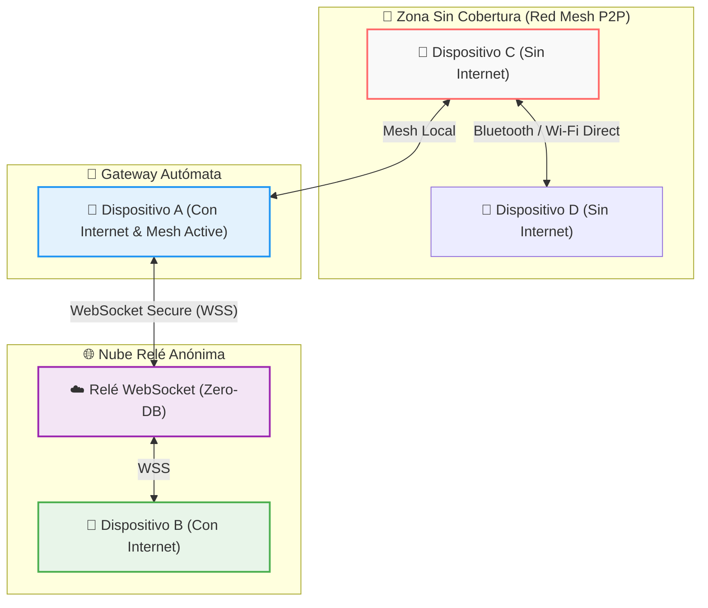

# ⚡ Dossier de Presentación Oficial: NoSense
### *Plataforma de Mensajería P2P Descentralizada, Anónima y de Transporte Híbrido*

---

<p align="center">
  <b>NoSense</b> — Comunicación sin fronteras, privacidad sin concesiones.
  <br>
  <i>Conecta a las personas en cualquier lugar, bajo cualquier circunstancia: con o sin cobertura de Internet.</i>
</p>

---

## 📌 1. Resumen Ejecutivo

En un mundo fuertemente interconectado pero técnicamente vulnerable, la dependencia exclusiva de servidores centralizados y de la infraestructura de Internet presenta serios riesgos: apagones de red durante desastres naturales, censura gubernamental, congestión en eventos masivos y recolección masiva de metadatos privados.

**NoSense** es una solución tecnológica de vanguardia diseñada para garantizar el derecho humano a la comunicación libre, privada y resiliente. Se trata de una aplicación móvil Android de mensajería descentralizada y anónima que implementa una **Arquitectura de Transporte Híbrido Inteligente**. 

NoSense opera simultáneamente en dos niveles:
1. **P2P Mesh (Fuera de Línea)**: Conexión directa dispositivo a dispositivo mediante radiofrecuencia (Wi-Fi Direct y Bluetooth Low Energy).
2. **Nube Relé Descentralizada (En Línea)**: Transmisión anónima mediante sockets en la nube sin almacenamiento de base de datos (`Zero-Logs DB`).

Gracias a su capacidad de **Gateway Bridging (Nodos Puente)**, cualquier dispositivo con acceso a Internet retransmite automáticamente y de forma totalmente cifrada los mensajes de los dispositivos cercanos sin cobertura hacia la red global, convirtiendo a la propia comunidad en la infraestructura.

---

## 🚀 2. Propuesta de Valor Única (USP)

| Pilar | Descripción Tradicional (Otras Apps) | La Solución NoSense |
| :--- | :--- | :--- |
| **Resiliencia de Red** | Requiere Internet/4G/5G constante. Si cae la red, la app deja de funcionar. | **Funciona 100% Offline y Online**. Conmuta dinámicamente según el entorno. |
| **Privacidad de Registro** | Exige número telefónico, correo electrónico o identidades vinculables. | **Identidad Criptográfica Efímera**. Cero datos personales requeridos. |
| **Almacenamiento en Nube** | Metadatos y respaldos almacenados en servidores de terceros. | **Zero-Knowledge / Zero-Logs**. Los relés sólo transportan paquetes cifrados. |
| **Infraestructura** | Servidores centrales vulnerables a caídas o bloqueos de IP. | **Red Mesh Descentralizada + Puente Gateway**. Malla distribuida entre pares. |

> [!IMPORTANT]
> **Privacidad por Diseño (Privacy by Design)**: NoSense no conoce la identidad real de sus usuarios, no rastrea ubicaciones ni conserva historiales de chat en servidores externos. La soberanía de los datos pertenece exclusivamente al dispositivo del usuario.

---

## 🌐 3. Arquitectura del Transporte Híbrido

NoSense elimina el punto único de fallo (*Single Point of Failure*) combinando redes en malla de corto alcance con relés globales.



### Mecanismos de Enrutamiento Inteligente:
* **Local Direct**: Si el destinatario está en el rango de radio local, el mensaje viaja punto a punto sin salir a Internet.
* **Gateway Bridging**: Si un paquete originado en la malla offline requiere llegar a un destino remoto, un nodo puente (*Gateway*) lo retransmite hacia el servidor relé en la nube sin poder descifrar su contenido.
* **Cloud Relay Direct**: Si ambos nodos cuentan con acceso a Internet, la entrega se efectúa de manera instantánea mediante WebSockets bidireccionales.

---

## 🛡️ 4. Seguridad y Modelo Criptográfico

La seguridad de NoSense se basa en estándares criptográficos de nivel militar probados:

* **Cifrado Extremo a Extremo (E2EE)**: Cada mensaje, estado o archivo se cifra en el dispositivo emisor utilizando el algoritmo **AES-256-GCM** (Galois/Counter Mode), garantizando confidencialidad e integridad del mensaje.
* **Almacenamiento en Hardware Seguro**: Las claves privadas se generan y custodian dentro del chip aislado del dispositivo (`AndroidKeyStore`), evitando que malware o extractores de memoria obtengan la clave.
* **Anonimato de Transmisión**: Los nodos intermediarios (nodos mesh vecinos y servidores relé) solo leen la cabecera del paquete (`MeshPacket`) indispensable para el enrutamiento (`recipientId`, `ttl`, `type`). La carga útil permanece completamente ininteligible para cualquier tercero.

> [!NOTE]
> **Defensa contra Inspección Profunda de Paquetes (DPI)**: Dado que el tráfico P2P utiliza descubrimientos locales cifrados y la conexión en nube utiliza TLS/WebSockets, el tráfico resulta indistinguible para los proveedores de servicios de Internet (ISP).

---

## ✨ 5. Funcionalidades Destacadas

1. **Mensajería Privada P2P**: Conversaciones directas de par a par con confirmación de entrega y cifrado punto a punto.
2. **Canales Públicos Comunitarios**: Espacios de difusión abierta para transmitir información relevante en comunidades, rescates o eventos masivos.
3. **Historias y Estados Efímeros (24h)**: Publicación de imágenes y texto con caducidad automática que se propagan dinámicamente por la red Mesh.
4. **Transferencia Eficiente de Archivos e Imágenes**: Sistema de compresión optimizado JPEG/Base64 para la transmisión rápida de fotografías sin colapsar el ancho de banda P2P.
5. **Interfaz de Usuario de Vanguardia**: Diseñada 100% en **Jetpack Compose** bajo estética neomórfica, animaciones fluidas y modo oscuro nativo adaptado para bajo consumo de batería (OLED).
6. **Autodetección de Nodos Cercanos**: Sin necesidad de emparejamiento manual complejo; los dispositivos se descubren automáticamente mediante la integración con Google Nearby Connections API.

---

## 💡 6. Casos de Uso e Impacto Social

```
 ┌─────────────────────────────────────────────────────────────────────────┐
 │                            CASOS DE USO                                 │
 ├───────────────────┬───────────────────┬─────────────────────────────────┤
 │  Desastres        │  Eventos          │  Zonas Remotas                  │
 │  Naturales        │  - Conciertos     │  y Expediciones                 │
 │  - Terremotos     │  - Estadios       │  - Montañismo y Senderismo      │
 │  - Huracanes      │  - Protestas      │  - Zonas Rurales                │
 │  - Apagones       │  - Transporte Marítimo/Aéreo    │
 └───────────────────┴───────────────────┴─────────────────────────────────┘
```

* **Respuesta ante Emergencias y Desastres Naturales**: En situaciones donde las torres de telefonía colapsan o se interrumpe la energía eléctrica, NoSense mantiene comunicados a equipos de respuesta primaria, familias y comunidades a través de la red en malla.
* **Eventos Masivos y Festivales**: Evita la saturación habitual de las redes 4G/5G en estadios o festivales, permitiendo a los asistentes comunicarse de manera fluida vía Wi-Fi Direct y Bluetooth.
* **Periodismo de Investigación y Activismo**: Herramienta indispensable en entornos de alta censura o vigilancia, permitiendo compartir testimonios y evidencias sin dejar rastros de metadatos o registros telefónicos.
* **Expediciones y Zonas Remotas**: Ideal para grupos de senderismo, alpinismo o trabajo de campo en áreas sin cobertura celular donde se requiere mantener contacto constante dentro del grupo.

---

## 🛠️ 7. Especificaciones Técnicas

* **Plataforma Objetivo**: Android 13 (API level 33) en adelante.
* **Lenguaje de Programación**: Kotlin (100% Código Nativo).
* **Arquitectura de Software**: Clean Architecture + MVVM + Hilt (Inyección de Dependencias).
* **UI Engine**: Jetpack Compose con componentes Material 3.
* **Persistencia Local**: Base de Datos Room con entidades protegidas.
* **Motor P2P Local**: Google Nearby Connections API (`Strategy.P2P_CLUSTER`).
* **Relé Nube**: Node.js WebSocket Server con conexión persistente OkHttp.

---

## 🗺️ 8. Hoja de Ruta (Roadmap)

- [x] **Fase 1 (Completada)**: Núcleo Mesh P2P local, transporte WebSocket, cifrado E2EE AES-256-GCM y UI Neomórfica en Jetpack Compose.
- [x] **Fase 2 (Completada)**: Implementación de Nodos Puente (*Gateway Bridging*), Canales Públicos, Historias efímeras de 24h y transferencia optimizada de imágenes.
- [ ] **Fase 3 (Próxima)**: Protocolo de enrutamiento multi-salto (*Multi-hop Routing*) dinámico para distancias ampliadas sin Internet.
- [ ] **Fase 4 (En Planificación)**: Llamadas de voz efímeras P2P comprimidas mediante códec Opus.
- [ ] **Fase 5 (Futura)**: Cliente multiplataforma (iOS y Escritorio) basado en Compose Multiplatform.

---

## 📞 9. Información de Contacto y Enlaces

NoSense es un proyecto de código abierto apasionado por devolver la soberanía digital a los usuarios.

* **Repositorio de Código**: [GitHub Repository](https://github.com/5u17im/sturdy-parakeet)
* **Descarga de APK Oficial**: [Última Release en GitHub Releases](https://github.com/5u17im/sturdy-parakeet/releases/latest)
* **Licencia**: Código abierto bajo Licencia MIT.

---

<p align="center">
  <b>NoSense — Diseñado para cuando la red falla. Construido para cuando la privacidad importa.</b>
</p>
