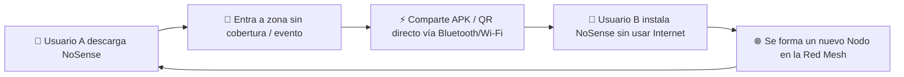

# 🚀 Estrategia Global de Marketing y Crecimiento: NoSense
### *Plan de Posicionamiento, Adquisición Orgánica y Product-Led Growth (PLG)*

---

<p align="center">
  <b>NoSense</b> — <i>"Cuando la red cae, tu voz permanece."</i>
  <br>
  Estrategia integral para posicionar NoSense como el estándar de mensajería privada, resiliente y descentralizada.
</p>

---

## 🎯 1. Diagnóstico y Filosofía de Marketing

El mercado de la mensajería instantánea está saturado de soluciones centralizadas (WhatsApp, Telegram, Signal) que dependen estrictamente de la infraestructura de Internet y exigen identificadores personales (número de teléfono o correo).

**NoSense** se posiciona como una alternativa **disruptiva, no convencional y soberana**. Nuestra estrategia de marketing no se basa en publicidad tradicional de pago (PPC), sino en **Product-Led Growth (PLG)**, la creación de comunidad, campañas virales de concienciación sobre la privacidad y guerrilla marketing en eventos masivos.

---

## 👥 2. Públicos Objetivo (Buyer Personas)

```
┌─────────────────────────────────────────────────────────────────────────────┐
│                          SEGMENTACIÓN DE AUDIENCIA                          │
├──────────────────────┬──────────────────────┬───────────────────────────────┤
│ 🛡️ El Cypherpunk /    │ 🎪 El Asistente a    │ 🏔️ El Aventurero y            │
│    Techie            │    Eventos Masivos   │    Comunidad de Emergencias   │
│                      │                      │                               │
│ - Busca privacidad   │ - Sufre la caída de  │ - Rutas de senderismo,        │
│   extrema.           │   redes 4G/5G en     │   zonas sin cobertura o       │
│ - Valora el código   │   conciertos,        │   zonas de desastres          │
│   abierto y E2EE.    │   festivales y       │   naturales.                  │
│                      │   estadios.          │                               │
└──────────────────────┴──────────────────────┴───────────────────────────────┘
```

### Archetype 1: **"El Guardián de la Privacidad" (Tech Enthusiast)**
* **Motivación**: Desconfianza en las Big Tech, búsqueda de anonimato real sin ceder números telefónicos ni metadatos.
* **Canales**: Reddit (`r/privacy`, `r/androiddev`, `r/selfhosted`), Hacker News, Twitter/X Tech, Mastodon/Matrix.

### Archetype 2: **"El Joven de Festivales y Eventos" (Gen Z / Millennial)**
* **Motivación**: Imposibilidad de enviar mensajes o localizar a sus amigos en festivales de música o estadios deportivos debido a la saturación de antenas celulares.
* **Canales**: TikTok, Instagram Reels, YouTube Shorts, campañas de guerrilla con código QR en festivales.

### Archetype 3: **"El Explorador y Rescatista" (Outdoor & Emergency Support)**
* **Motivación**: Necesidad de comunicación de grupo en zonas sin cobertura celular (montaña, mar, zonas rurales) o durante catástrofes naturales y apagones.
* **Canales**: Foros de senderismo/alpinismo, grupos de radioaficionados, ONGs de respuesta ante emergencias.

---

## 📢 3. Posicionamiento de Marca y Mensajería Clave

### Eslogan Principal:
> **"NoSense — Cuando la red cae, tu voz permanece."**

### Mensajes Secundarios por Pila de Comunicación:
* **Resiliencia**: *"Sin Internet, sin señal, sin problemas. Comunícate directo de teléfono a teléfono."*
* **Privacidad**: *"Sin número de teléfono. Sin registros en la nube. Tu identidad es tuya."*
* **Comunidad**: *"Transforma a tu grupo en una red indestructible."*

---

## 🌀 4. Bucles de Viralidad del Producto (Product-Led Growth)

El motor principal de crecimiento de NoSense debe ser **la propia aplicación**:



### Estrategias de Viralidad Incorporadas (In-App):
1. **Compartir APK Offline en 1 Clic**: Botón visible en el menú principal: *"Enviar NoSense a un amigo cercano vía Bluetooth/Wi-Fi Direct"*. Esto permite difundir la aplicación incluso en lugares donde no hay Internet para descargarla de una tienda.
2. **Código QR de Conexión Instantánea**: Escaneo rápido para vincularse a la red Mesh de un grupo sin configuraciones complejas.
3. **Efecto de Red Mesh local**: A mayor cantidad de usuarios en una zona, la cobertura de la malla se multiplica, incentivando a cada usuario a recomendar la app a su entorno inmediato.

---

## 🎯 5. Estrategia por Canales y Acciones Tácticas

### 🎬 A. Contenido Viral en Formato Corto (TikTok / Reels / Shorts)
* **Concepto de Vídeo "El Experimento Mesh"**: 
  * Mostrar 2 teléfonos en **Modo Avión** (sin SIM, sin Wi-Fi de Internet, sin datos).
  * Alejar los teléfonos a 50 metros o a través de paredes.
  * Enviar una foto o mensaje cifrado en NoSense y mostrar cómo llega al instante.
  * *Hook*: *"El secreto de mensajería que las compañías telefónicas no quieren que sepas en un festival"*.

### 🎪 B. Guerrilla Marketing en Eventos Masivos y Festivales
* **Puntos de Conexión Mesh en Festivales**:
  * Desplegar voluntarios o banners con códigos QR gigantes en las entradas de festivales de música masivos o estadios.
  * Mensaje del cartel: *"¿Te quedaste sin datos o no salen tus mensajes? Descarga NoSense por Wi-Fi Local aquí y chatea con tus amigos gratis sin red"*.

### 💻 C. Estrategia de Lanzamiento en Comunidades Tech & Open Source
* **Show HN (Hacker News)**: Publicación con título técnico atractivo: *"Show HN: NoSense – Open-source hybrid P2P mesh + zero-log cloud relay messaging for Android"*.
* **Lanzamiento en Product Hunt**: Diseñar una página de producto enfocada en la resiliencia en desastres y la estética neomórfica de la UI.
* **Reddit Growth**: Artículos detallados en `r/privacy`, `r/androiddev` y `r/cyberpunk` exponiendo la arquitectura híbrida y la ausencia de bases de datos centralizadas.

### 📰 D. Relaciones Públicas y Prensa Tecnológica (PR)
* Enviar notas de prensa a portales tecnológicos (Xataka, Genbeta, TechCrunch, El Output, Gizmodo) enfocadas en la resiliencia ante desastres naturales y apagones.
* *Titular de prensa sugerido*: *"NoSense: La app de sello hispano que permite enviar mensajes cifrados sin señal de Internet ni número de teléfono"*.

---

## 📊 6. Métricas Clave y KPIs de Éxito

| Categoría | Métrica Clave | Objetivo (Primeros 6 Meses) |
| :--- | :--- | :--- |
| **Adquisición** | Descargas Totales de APK (GitHub / Tiendas) | 50,000+ instalaciones |
| **Viralidad** | Coeficiente K ($K = \text{invitaciones} \times \text{conversión}$) | $K > 1.2$ (Crecimiento orgánico sostenido) |
| **Adopción Offline** | Porcentaje de transferencias de APK P2P local | > 25% de las descargas activadas de par a par |
| **Retención** | Tasa de Retención a 30 días (D30) | > 40% en usuarios activos de comunidades |
| **Comunidad** | Estrellas en el repositorio GitHub | 1,500+ Stars |

---

## 🗓️ 7. Plan de Acción por Fases (Roadmap de Marketing)

```
 ┌─────────────────────────────────────────────────────────────────────────┐
 │                      CRONOGRAMA DE EJECUCIÓN                            │
 ├───────────────────┬───────────────────┬─────────────────────────────────┤
 │ FASE 1: Sem 1-4  │ FASE 2: Sem 5-8   │ FASE 3: Sem 9-16                │
 │ Semillero y Dev   │ Lanzamiento       │ Expansión por Eventos y         │
 │ Community         │ Público & Viral   │ Alianzas                        │
 └───────────────────┴───────────────────┴─────────────────────────────────┘
```

### **Fase 1: Semillero y Dev Community (Semanas 1-4)**
* [ ] Optimizar la landing page oficial y el repositorio en GitHub con assets visuales y GIFs del funcionamiento.
* [ ] Publicación en Hacker News (Show HN) y subreddits especializados (`r/privacy`, `r/androiddev`).
* [ ] Campaña con creadores de contenido del nicho de ciberseguridad y software libre para revisiones de código y auditoría abierta.

### **Fase 2: Lanzamiento Público & Viral Hacking (Semanas 5-8)**
* [ ] Lanzamiento oficial en Product Hunt.
* [ ] Publicación de los primeros 5 vídeos virales demostrativos en TikTok y Instagram Reels ("Experimento Modo Avión").
* [ ] Distribución de notas de prensa en medios de tecnología especializados.

### **Fase 3: Expansión por Eventos y Alianzas (Semanas 9-16)**
* [ ] Ejecutar campaña de guerrilla en festivales de música o eventos deportivos locales.
* [ ] Establecer contacto con asociaciones de senderismo, grupos de rescate y ONGs para pruebas de campo en zonas sin cobertura.
* [ ] Lanzar el programa de **"Embajadores de Nodo"** (usuarios que despliegan servidores relé comunitarios).

---

<p align="center">
  <b>NoSense — Construyendo la red de mensajería más resiliente del mundo, un nodo a la vez.</b>
</p>
